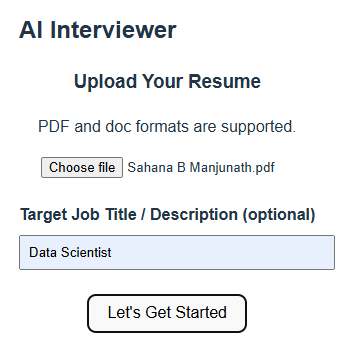
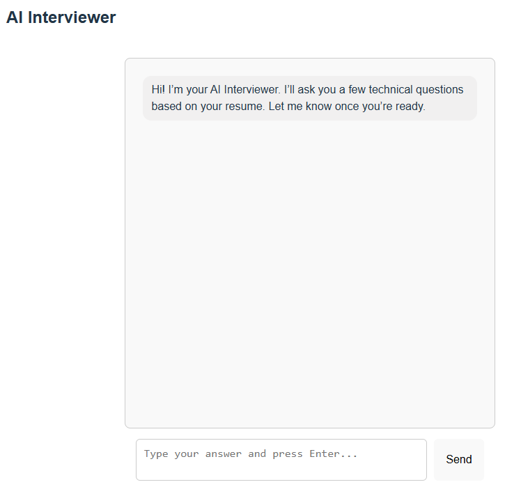
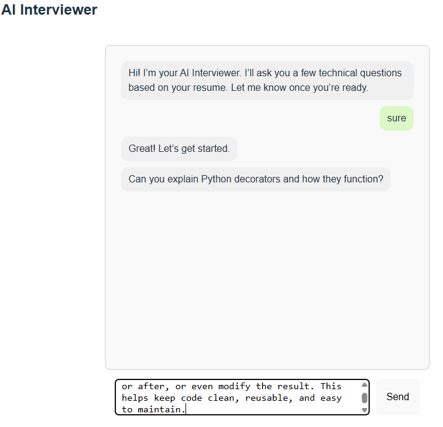
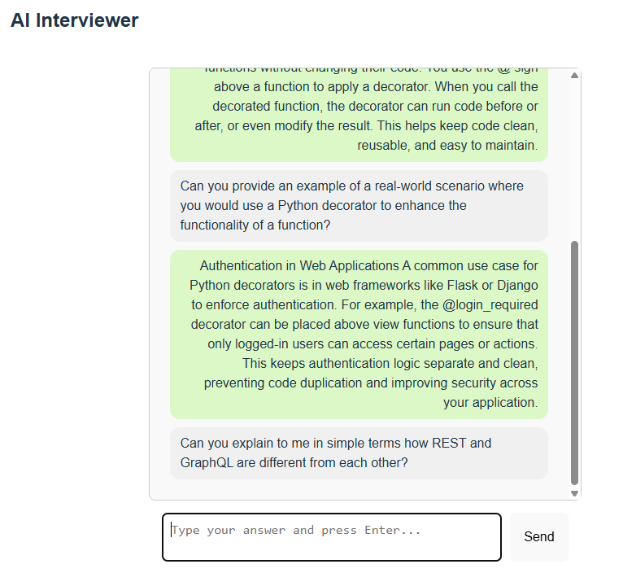
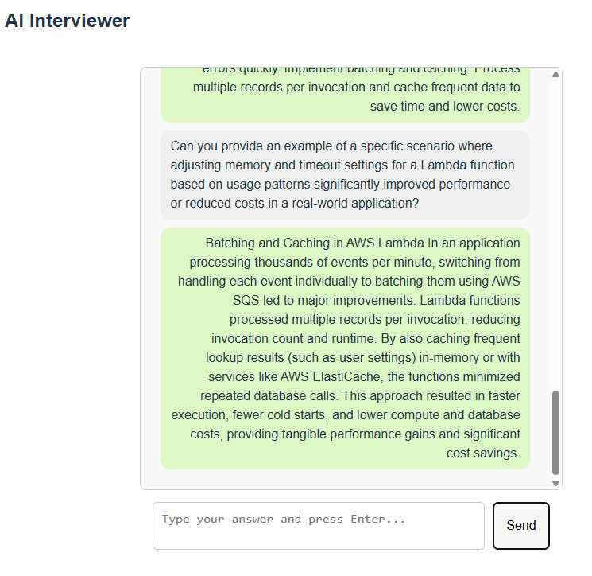
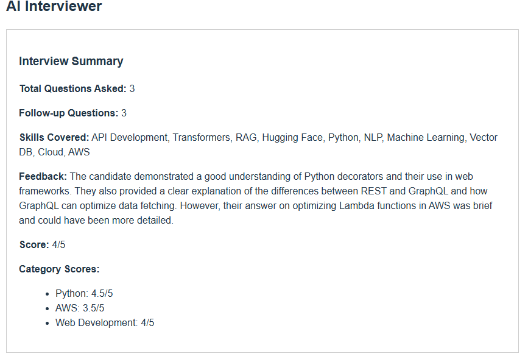

# AI Interviewer

This project is an AI powered interviewer web application that utilizes Retrieval Augmented Generation (RAG) to conduct contextual technical interviews based on a candidate's resume. It supports resume uploads, dynamically generates relevant questions, and concludes with a personalized performance summary.

---

## Project Structure

* **Frontend**: React.js (chat UI)
* **Backend**: FastAPI (Python)
* **LLM Provider**: OpenAI (GPT-3.5-turbo)
* **Vector Store**: FAISS (in memory)
* **Skill Extraction**: LLM-based parsing from raw resume text

---

## Setup Instructions

### 1. Clone the Repository

```bash
git clone https://github.com/5ahanaBM/AI_Interviewer_MVP
cd AI_Interviewer_MVP
```

### 2. Backend Setup (FastAPI)

#### a. Create Virtual Environment

```bash
python -m venv venv
source venv/bin/activate  # Windows: venv\Scripts\activate
```

#### b. Install Dependencies

```bash
pip install -r requirements.txt
```

#### c. Set OpenAI API Key

Create a `.env` file with:

```
OPENAI_API_KEY=your_openai_key_here
```

#### d. Run the Backend

```bash
uvicorn main:app --reload
```

By default, the backend runs on `http://localhost:8000`.

### 3. Frontend Setup (React)

#### a. Navigate to `frontend/`

```bash
cd frontend
```

#### b. Install Dependencies

```bash
npm install
```

#### c. Start React App

```bash
npm run dev  # or npm start depending on tooling
```

Frontend should now be available on `http://localhost:5173`.

---

## Core Features

### Resume Upload

* Supports PDF and DOC formats.
* Allows optional user input for job title or job description.
* Skills and experience are extracted using OpenAI's LLM via structured prompts.

### Interview Flow

* The AI begins with a greeting and waits for the candidate to confirm readiness.
* A base question is asked, followed by a follow-up question.
* Questions are conversational and adapted to the user’s resume and job title/description.
* The flow comprises of 6 questions (configurable via backend).

### Chat UI

* Multi line input box for user responses with a helpful placeholder.
* Chat window automatically scrolls to the latest message.
* Clean, UI with native React state management.

### Question Generation

* Base questions are retrieved from a `questions.json` file.
* Each question is rephrased to be friendly using the chat completion API.
* Follow-up questions are generated using context from the base question and the user's answer.
* Job-aware prompting: if a job title or description is present, prompts are tailored accordingly.

#### Question Retrieval Strategy
* Initially, a generic FAISS `similarity_search_with_score()` method was implemented to search for questions by raw query string. However, this was replaced by a more robust method: `select_relevant_questions(skills)`, which embeds extracted skills from the resume and queries FAISS for aligned questions.
* This skill-anchored retrieval ensures diversity, precision, and stronger relevance than free-text query matching.

### Interview Summary

* Once all questions are answered, the LLM reviews the full Q\&A transcript.
* The summary includes:
  * Total questions asked
  * Number of follow-up questions
  * Skills inferred
  * Overall feedback with critical analysis
  * Category-wise scoring (e.g., technical depth, communication, completeness)

---

## Design Decisions

* **LLM-Driven Parsing**: OpenAI chat model is used for extracting structured skills and experiences.
* **Prompt Modularity**: Prompt creation is centralized and adjustable.
* **No Heavy Dependencies**: No third-party resume parsing libraries beyond PyMuPDF.
* **FAISS**: Used for vector-based question retrieval, keeping the solution lightweight and local.
* **In memory Session State**: Suitable for demo scale interviews; sessions are not persisted.
* **React Frontend**: Native state without Redux to keep UI interactions fast and simple

---

## Enhancements Implemented

* Job-aware prompt logic in backend
* Improved LLM prompt chaining for follow-ups and summaries
* Multi-line chat input with placeholder text
* Auto-scroll on new messages
* Category-level scoring in feedback summary

---

## Demo Screens

### Resume Upload


### Chat with AI Interviewer





### Interview Summary



## Trade offs

* LLM based parsing offers richer context understanding but may occasionally hallucinate or misformat JSON.
* There's a dependency on external API availability and cost.
* No persistent DB or user login to maintain candidate history.
* Question variety and tagging are handcrafted; could be extended with real-world job datasets.
* Stateless vector store not optimized for large-scale use cases.

---

## Future Improvements

* Dynamic question generation without `questions.json`
* Role-specific interview paths
* Configurable interview length and difficulty
* Audio/video interaction support
* Admin dashboard for analytics and question uploads
* Advanced rubric chaining for better evaluation
    * Multi-dimensional scoring (correctness, completeness, communication, confidence)
* Persistent user sessions and history
* Periodic question refresh or rotation via LLM